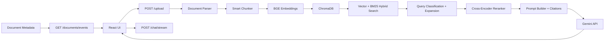

# AI Document Chat Assistant

A production-ready Retrieval-Augmented Generation system for chatting with uploaded PDF, DOCX, TXT, and CSV documents.

## Stack

- Frontend: React, Vite, TailwindCSS, React hooks
- Backend: FastAPI
- Vector database: ChromaDB
- Embeddings: `BAAI/bge-small-en-v1.5`
- Reranker: `cross-encoder/ms-marco-MiniLM-L-6-v2`
- LLM: Gemini API, configurable with environment variables
- Document processing: PyMuPDF, python-docx, pandas

## Features

- Multi-file upload with processing progress
- Persistent uploaded file storage in `backend/uploads/`
- Sidebar document list with delete support
- PDF, DOCX, TXT, and CSV text extraction
- Metadata-preserving chunking by headings, paragraphs, and sentence windows
- ChromaDB vector persistence
- BM25 keyword search, vector search, and weighted hybrid retrieval
- Query classification and deterministic query expansion
- Cross-encoder reranking from top 20 to top 5
- Strict grounded prompt orchestration
- Source citations generated from chunk metadata
- Retrieval confidence labels and "Why this answer?" evidence panel
- Document executive summary, suggested questions, key topics, dates, and action items
- Session-based chat history for follow-up questions
- Server-Sent Events chat updates with typing indicator
- Live document status updates with Server-Sent Events
- Admin evaluation dashboard for document, chunk, retrieval, generation, and query metrics

## Project Structure

```text
backend/
  main.py
  routes/
  services/
  models/
  rag/
    parser.py
    chunker.py
    embeddings.py
    retriever.py
    reranker.py
    prompt_builder.py
    citation_builder.py
  vectordb/
  uploads/
frontend/
  src/
    pages/
    components/
    services/
    hooks/
    utils/
docs/
  API.md
```

## Architecture Diagram



## Environment Variables

| Variable | Purpose | Default |
| --- | --- | --- |
| `GEMINI_API_KEY` | Gemini API key used for answer generation | required |
| `LLM_TEMPERATURE` | Generation temperature | `0.1` |
| `LLM_TIMEOUT_SECONDS` | Gemini REST timeout | `30` |
| `GEMINI_MODEL` | Gemini model name | `gemini-2.5-flash-lite` |
| `EMBEDDING_MODEL` | SentenceTransformers embedding model | `BAAI/bge-small-en-v1.5` |
| `RERANKER_MODEL` | Cross-encoder reranker model | `cross-encoder/ms-marco-MiniLM-L-6-v2` |
| `CHUNK_SIZE` | Target chunk size in characters | `500` |
| `CHUNK_OVERLAP` | Overlap between long chunks | `100` |
| `MAX_UPLOAD_SIZE_MB` | Per-file upload limit | `25` |
| `MAX_UPLOAD_FILES` | Maximum files per upload request | `10` |
| `VITE_API_BASE_URL` | Frontend API base URL | `http://127.0.0.1:8001` |
| `ALLOWED_ORIGIN_REGEX` | Optional regex for preview deployments such as Vercel | `https://.*\.vercel\.app` |
| `MODEL_LOCAL_FILES_ONLY` | Load embedding/reranker models only from cache | `false` locally, `true` in Docker |
| `INDEXING_WORKERS` | Number of background document indexing workers | `1` |

## Installation

### 1. Configure environment

Copy `.env.example` to `.env` and set your Gemini key:

```bash
GEMINI_API_KEY=your-key
GEMINI_MODEL=gemini-2.5-flash-lite
```

The model name, embedding model, reranker model, model cache path, chunk size, frontend API base URL, and CORS origins are all environment-configurable.

### 2. Install backend dependencies

```bash
python -m venv .venv
.venv\Scripts\activate
pip install -r requirements.txt
```

On first upload or chat, SentenceTransformers downloads the embedding and reranker models. After models are cached under `backend/vectordb/model_cache`, runtime loading is forced to local files to avoid slow Hugging Face retries in restricted network environments.

For deployment, prefer the provided Dockerfile. It downloads the embedding and reranker models during image build, then runs with `MODEL_LOCAL_FILES_ONLY=true`, so user uploads are not blocked by model downloads. If deploying without Docker, expect the first indexed document to be slower unless the model cache is already present.

Do not mount a volume over `/app/backend/vectordb/model_cache` in Docker, because that hides the pre-baked model cache and makes upload/indexing slow again. The included `docker-compose.yml` stores persistent uploads, Chroma data, and JSON metadata under `/data` while leaving model cache inside the image.

### 3. Install frontend dependencies

```bash
cd frontend
npm install
```

### 4. Run the backend

From the repository root:

```bash
uvicorn backend.main:app --host 127.0.0.1 --port 8001 --reload
```

### 5. Run the frontend

From `frontend/`:

```bash
npm run dev
```

Open `http://localhost:5173`.

## API Documentation

See [docs/API.md](docs/API.md).

Architecture and implementation decisions are documented in [docs/ARCHITECTURE.md](docs/ARCHITECTURE.md).

Interactive OpenAPI docs are available while the backend is running:

- `http://127.0.0.1:8001/docs`
- `http://127.0.0.1:8001/redoc`

## Retrieval Quality Notes

The retrieval layer first classifies each query as `search`, `summary`, `comparison`, or `follow_up`, then expands abbreviations and ambiguous follow-up wording before retrieval. It combines dense semantic search and BM25 keyword matching. Dense search handles paraphrase and semantic similarity, while BM25 protects exact terms such as policy names, IDs, table values, and CSV column values. Results are merged with:

```text
final_score = 0.7 * vector_score + 0.3 * keyword_score
```

The top 20 hybrid results are reranked with `cross-encoder/ms-marco-MiniLM-L-6-v2`, then only the best 5 chunks are sent to Gemini. The chat endpoint returns citations, confidence, query understanding, retrieved evidence scores, and the final context used for answer generation. Chat responses are delivered through Server-Sent Events so the frontend can show progress and completion events consistently.

## Explainability

Every answer includes a structured explanation payload used by the UI's "Why this answer?" panel:

- query type and expanded search queries
- retrieved chunks
- vector, keyword, fused, and reranker scores
- final prompt context sent to Gemini
- source previews and confidence labels

This makes retrieval behavior auditable during evaluation and helps diagnose low-confidence answers.

## Engineering Decisions and Trade-offs

### Why ChromaDB Was Chosen

ChromaDB is lightweight, persistent, and simple to run locally. It supports metadata storage and filtering, which keeps citations tied to filenames, page numbers, sections, and chunk IDs. For a larger multi-tenant deployment, a managed vector database or PostgreSQL with pgvector would be easier to operate at scale.

### Why `BAAI/bge-small-en-v1.5` Was Selected

`bge-small-en-v1.5` offers a strong balance between retrieval quality and local performance. It is small enough for developer machines while still producing useful semantic embeddings for English documents. Larger embedding models may improve recall but increase latency and memory usage.

### Why Chunk Size 500 and Overlap 100 Were Chosen

A 500-character target chunk keeps retrieved context focused and citation-friendly. A 100-character overlap reduces the risk of splitting an important sentence or paragraph boundary. This is a practical default; production systems should tune chunking with an evaluation set.

### Why Hybrid Retrieval Was Implemented

Dense vectors handle paraphrases and semantic similarity. BM25 handles exact phrases, IDs, names, numbers, and CSV values. Combining both reduces retrieval blind spots and improves robustness across different document types.

### Scalability Limitations

The local version stores metadata and metrics in JSON files and keeps chat memory in process memory. This is clear for evaluation and local development, but multi-worker deployments should use PostgreSQL or Redis. Document processing currently runs as FastAPI background tasks; high-volume usage should move this to a worker queue.

### Future Improvements

- Add authentication and per-user document isolation.
- Add Redis/PostgreSQL for sessions, metadata, and metrics.
- Add object storage for uploaded files.
- Add retrieval evaluation datasets and citation accuracy checks.
- Add queue-based document processing with retries.
- Add provider interfaces for swapping Gemini, vector stores, and embedding models.
- Migrate frontend files from JSX to TypeScript for stricter compile-time contracts.

## Citation Behavior

The prompt requires every factual sentence to use source markers such as `[1]`. The backend also returns a structured `sources` array built from chunk metadata:

```text
[1] EmployeeHandbook.pdf, Page 4
```

If the answer cannot be found in retrieved context, the assistant must return:

```text
Information not found in uploaded documents.
```

## Operational Notes

- Uploaded files are stored in `backend/uploads/`.
- ChromaDB and JSON metadata are stored in `backend/vectordb/`.
- Session memory is process-local and intended for active chat sessions.
- For multi-worker or distributed deployment, move sessions, metadata, and metrics to Redis/PostgreSQL and use shared object storage for uploads.
- Keep `.env`, uploads, and vector database files out of git.
